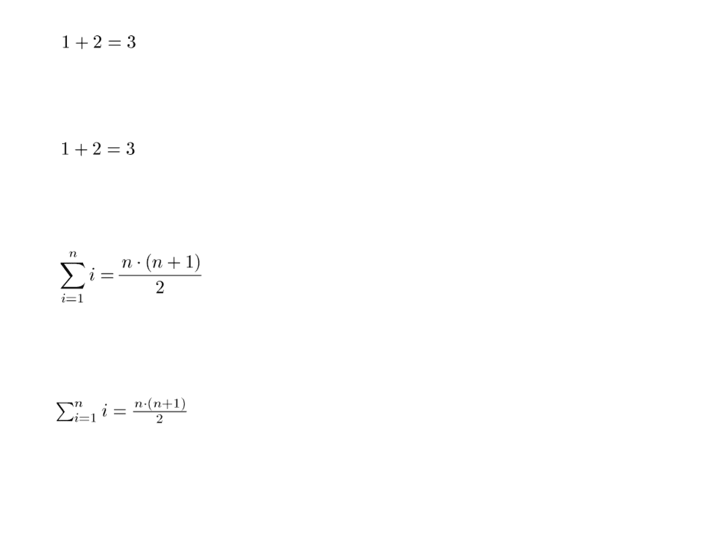
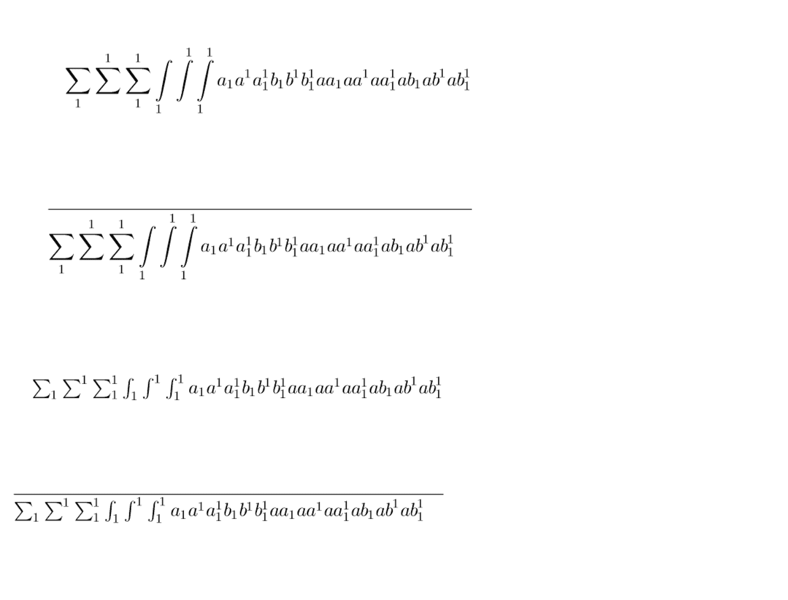

A re-implementation of TeX's formula layout in SML
==================================================

> with some update to support [SML/NJ 110.99.1](https://www.smlnj.org/)

You can use those code in 2-clause BSD license: [reduce-algebra/reduce-algebra/contrib/boxdisplay/sml](https://github.com/reduce-algebra/reduce-algebra/blob/master/contrib/boxdisplay/sml/README)

linked paper:
+ (Capsule Review) neuform.ps [A Functional Description of TeX's Formula Layout](https://www.rw.cdl.uni-saarland.de/people/heckmann/private/abstracts/neuform-review.html)
+ PDF version [neuform.pdf](https://people.eecs.berkeley.edu/~fateman/temp/neuform.pdf)


## Compile

```bash
# clone project
git clone https://github.com/TeX-host/formulae
cd formulae

# generate dvi files
# for Win: `SMLNJ\bin\sml.bat`
sml CI.sml
```

+ 4 simple equtions in `test1.dvi`
    
+ 4 complex equtions in `test2.dvi`
    


**explore**

```sh
# start SML in project dir
# for Win: `SMLNJ\bin\sml.bat`
sml

# run project in SML repl
use "edit.m";
U "all";

# gen test1.dvi
test1 ()
# gen test2.dvi
test2 ()

# explore the project in REPL
```


## [Overview](OVERVIEW.md)


## The original description

```
This directory contains a re-implementation of TeX's formula layout
written in Standard ML of New Jersey, version 109.2
by Reinhold Heckmann, Universitaet des Saarlandes,
following suggestions by Reinhard Wilhelm, Universitaet des Saarlandes.

WARNING:  The system is still in the status of development.
-------   This distribution may contain errors of any kind.

The present system can typeset nearly all formulae
by translating them from formula terms (see MathTypes.sml)
into box terms (see BoxTypes.sml).
The only exceptions are accents, roots, and big delimiters.
The resulting box terms can be translated into dvi output.
At present, there is no good way to enter formulae;
a parser is needed which can read TeX input and build formula terms from it.
Also, the testing possibilities and user friendliness
are not yet well developed.

To install:
   get formulae.tar.gz
   zcat formulae.tar.gz | tar -xf -
This gives a directory called `formulae'.
Go into this directory.
Start sml (best: Standard ML of New Jersey, version 109.2).
   use "edit.m";
   U "all";
... and everything is read in and translated (hopefully).

At the moment, the system provides two test functions (see test.sml)
  test1, test2: unit -> unit
which, when executed, typeset certain fixed formulae,
translate them to dvi and write them into file  "das.dvi".
(Sorry, this file name is built in.)
As an example, the distributed system contains
the file "das.dvi" resulting from running test1.
It also contains a TeX file "dastex.tex" which contains the formulae
of test2 to allow comparing TeX layout with our system's layout.
More tests can be programmed by editing or augmenting file "test.sml".

The typesetting system itself is contained in files "----.sml".
For a rough description of their organization, see file "OVERVIEW".
In addition, there are files RM05 ... RM10 MI05 ... MI10 SY05 ... SY10 EX09 EX10
which contain condensed font information (height, depth, and width of characters).
These files have been derived from TeX's TFM files.

File "edit.m" contains functions which provide access to the Unix editor "vi"
from within sml.
   E "xxx";
runs the editor on file "xxx.sml" (note the addition of the suffix).
After leaving the editor, the file is reloaded
if there have been any changes to it.
A call
   U "xxx";
loads file "xxx.sml" without editing.
Both functions store the file name internally;
if the same file is to be edited / loaded again,
it suffices to call
   E "";
and likewise with U.

File "all.sml" contains a sequence of U's
which load the files containing the system in their proper order.
(Sorry, there is no "make" or any other kind of source code management.)

Documentation:
The core system is described in the paper
"A Functional Description of TeX's Formula Layout"
submitted to Journal of Functional Programming.
Unfortunately, there is no documentation of the usage of the system
other than the remarks in this file
(mainly because we have not yet implemented a nice user interface).
```

## [License](LICENSE.md)

```
// SPDX-License-Identifier: BSD-2-Clause
```
